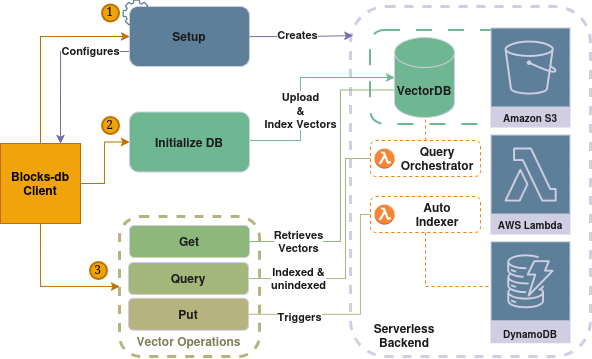

<div align="center">

# Blocks-DB: Serverless Vector Database

<p>
  
  
  <a href="https://doi.org/10.1145/3769769"></a>
</p>

<div align="center" style="margin: 30px 0;">
  
</div>

</div>

---

Blocks-DB is a modular serverless vector database built on Lithops and AWS Lambda. It supports block-based indexing with FAISS, distributed querying, and a simple CLI or Python client interface.

---

## 📋 Requirements

- **Python 3.10** (venv use recommended)
- **Docker** & **Docker Hub account**
- **AWS account** with access to: S3, Lambda, DynamoDB, ECR, IAM
- **Existing S3 bucket** for storing vectors and indexes

---

## 📦 Installation

```bash
# Clone the repository
git clone https://github.com/Oct-HI/blocks-db-wip
cd blocks-db

# (Optional) Create virtual environment
python -m venv venv
source venv/bin/activate

# Install the package
pip install .
```

---

## 🚀 Quickstart (minimal workflow)

```bash
# 1. Save default bucket and region
blocks-db configure --bucket my-bucket --region us-east-1

# 2. Create AWS infrastructure (Lambda, DynamoDB, ECR, S3 triggers)
blocks-db setup --bucket my-bucket

# 3. Index a dataset (needs an index config JSON — see below)
blocks-db initialize-database my-dataset vectors.csv --config config.json

# 4. Add more vectors incrementally
blocks-db put my-dataset new_vectors.csv

# 5. Search (hybrid: index + pending by default)
blocks-db query my-dataset --file queries.csv --k 10

# 6. Check status
blocks-db status my-dataset -v
```

Each command is explained in detail below.

---

## ⚙️ Initial Setup

### 1. Configure AWS credentials

> **Recommended:** Configure AWS credentials using `~/.aws/credentials` file:
> ```bash
> aws configure
> ```

This is the recommended way. Blocks-DB will automatically read credentials from your AWS config.

Alternatively, you can set environment variables:
```bash
export AWS_ACCESS_KEY_ID=your-key
export AWS_SECRET_ACCESS_KEY=your-secret
export AWS_DEFAULT_REGION=us-east-1
```

### 2. Save default bucket and region

```bash
blocks-db configure --bucket your-s3-bucket --region us-east-1
```

For SQS-based auto-indexer:
```bash
blocks-db configure --bucket your-s3-bucket --region us-east-1 --sqs
```

This saves configuration to `~/.blocks-db-config/backend_config.json`.

---

## 🚦 Auto-Indexer Modes

Blocks-DB supports three auto-indexer configurations, selected at `setup`:

| Mode | `setup` flag | `configure` flag | Use case |
|------|:------------:|:----------------:|----------|
| **S3 Triggers** (default) | *(none)* | *(none)* | Standard S3 buckets with notification support |
| **SQS** | `--sqs` | `--sqs` | Buckets without S3 notification support, or when you prefer queue-based triggers |
| **S3 Express One Zone** | `--s3express` | *(auto-detected)* | S3 Express One Zone buckets (name ends in `--x-s3`). Auto-enables SQS since Express buckets don't support S3 notifications |

### How it works

- **S3 Triggers**: Uploading a CSV to `pending/<dataset>/` fires a Lambda notification directly.
- **SQS**: The CLI sends a message to an SQS queue after each `put`. Lambda polls the queue. Includes a DLQ for failed messages.
- **S3 Express**: Same as SQS, plus adds `s3express:CreateSession` permission to the Lambda role and auto-detects the availability zone from the bucket name.

---

## 🏃 Quick Start

### Setup: Create infrastructure

```bash
# Default — S3 Triggers
blocks-db setup --bucket your-s3-bucket

# SQS mode
blocks-db setup --bucket your-s3-bucket --sqs

# S3 Express One Zone mode (auto-enables SQS)
blocks-db setup --bucket your-bucket--use1-az6--x-s3 --s3express
```

Creates:
- Lambda Layer with FAISS
- Lambda function for auto-indexing
- DynamoDB table for index tracking
- S3 triggers **or** SQS queue (+ DLQ) for auto-indexing
- Lithops runtime in ECR

**Customize names:**

```bash
blocks-db setup --bucket your-s3-bucket \
  --runtime-name mi-runtime \
  --function-name mi-autoindexer \
  --table-name mi-tabla \
  --layer-name mi-layer \
  --role-name mi-rol
```

**Other options:**
```bash
# Custom threshold (bytes) for auto-indexer block size
blocks-db setup --bucket your-bucket --threshold 10485760

# Skip DynamoDB table or Lithops runtime (if already built)
blocks-db setup --bucket your-bucket --skip-vector-table --skip-runtime
```

> **Warning:** Ensure these resources do not already exist, or the setup will fail or update existing resources.

### Initialize database

```bash
blocks-db initialize-database mydataset vectors.csv --config config.json --workers 16
```

This requires an **index config file**. Example (`config.json`):

```json
{
  "features": 96,
  "num_vectors": -1,
  "k_search": 10,
  "k_result": 10,
  "skip_init": false,
  "skip_kmeans": false,
  "kmeans_version": "unbalanced",
  "implementation": "blocks",

  "replication": 1.0,
  "num_index": 16,
  "num_centroids_search": 4,
  "k": 512,
  "n_probe": 32,
  "query_batch_size": 4,

  "index_mem": 10240,
  "search_map_mem": 8192,
  "search_reduce_mem": 2048
}
```

**Parameters:**

| Parameter | Description |
|-----------|-------------|
| `features` | Vector dimensionality |
| `implementation` | "blocks" (default) — block-based indexing |
| `num_index` | Number of index blocks (default: 16) |
| `k` | FAISS IVF k (default: 512) |
| `n_probe` | FAISS IVF n_probe (default: 32) |
| `index_mem` | Index Lambda memory in MB (default: 10240) |
| `search_map_mem` | Search map Lambda memory in MB (default: 8192) |
| `search_reduce_mem` | Search reduce Lambda memory in MB (default: 2048) |
| `replication` | Replication factor |
| `num_vectors` | Total vectors in dataset (-1 = auto-detect) |
| `k_search` | K for search calculation |
| `k_result` | K for final results |
| `query_batch_size` | Query batch size |
| `num_centroids_search` | Centroids to search |
| `skip_init` | Skip initialization |
| `skip_kmeans` | Skip k-means clustering |
| `kmeans_version` | K-means version |

**Options:**

```bash
# Skip auto-update of Lambda threshold
blocks-db initialize-database mydataset vectors.csv --config config.json --no-update-threshold

# Build csv_blocks from local file (skip S3 re-download during tracking)
blocks-db initialize-database mydataset vectors.csv --config config.json --build-local

# Skip DynamoDB state init and vector tracking (benchmark purity)
blocks-db initialize-database mydataset vectors.csv --config config.json --skip-auto-indexer
```

After initializing, the threshold is automatically configured based on the initial config (num_index, features) and estimated vector size. This threshold controls the size of each block for auto-indexing — the system tries to get as close as possible to this size.

### Add more vectors

```bash
blocks-db put mydataset new_vectors.csv
```

Vectors are stored as "pending" and included in searches automatically.

**With metadata tags:**
```bash
blocks-db put mydataset new_vectors.csv --tags '{"source":"web","category":"news"}'
```

Tags are stored per batch and can be used to filter searches later. Each vector in the batch inherits the same tags.

**Per-vector tags (3rd CSV column):**

Alternatively, each row in the CSV can carry its own tags as a JSON third
column. This is more granular than batch-level `--tags`:

```
1 0.1 0.2 ... {"source":"web","priority":"high"}
2 0.4 0.5 ... {"source":"api","priority":"low"}
```

When `--tags` and per-vector tags are both present, per-vector tags take
precedence.

**Single-vector mode:**
```bash
blocks-db put mydataset single_vector.csv --single
```

### Update threshold (after initialize-database)

If you used `--no-update-threshold` or want to adjust manually:

```bash
# Manual value
blocks-db update-threshold 10485760

# Auto-calculate from dataset config
blocks-db update-threshold --dataset mydataset --bucket your-bucket
```

### Query

```bash
# Single vector
blocks-db query mydataset --vector "0.1 0.2 0.3 ..."

# From CSV file
blocks-db query mydataset --file queries.csv --k 10
```

By default searches in index + pending. For index-only search:
```bash
blocks-db query mydataset --file queries.csv --indexed-only
```

**Filtered search (requires tags on put):**
```bash
# Only search centroids and pending files matching ALL specified tags
blocks-db query mydataset --file queries.csv --k 10 --filter '{"source":"web"}'
```

**Filter modes:**

| Mode | Flag | Behavior |
|------|------|----------|
| Post-filter (default) | `--filter-mode post` | Overfetches k×2 per centroid, discards non-matching. Fast, default. |
| Pre-filter | `--filter-mode pre` | Uses reverse index per centroid to restrict FAISS search to only matching IDs. May find results post-filter misses. |

Post-filter is the default and performs well for most use cases. Pre-filter
may find more results since it doesn't rely on overfetching, at the cost of
loading a reverse index per centroid.

**Get vectors by tags:**

```bash
blocks-db get-by-tags mydataset --filter '{"priority":"high"}' --limit 20
```

Lists vector IDs whose tags match the filter. Useful for inspection.

**Custom batch size** (number of centroid `.ann` files per map worker):
```bash
blocks-db query mydataset --file queries.csv --batch-size 2
```

### Status

```bash
blocks-db status mydataset

# With details
blocks-db status mydataset -v
```

---

## 📖 Commands Reference

| Command | Description | Usage |
|---------|-------------|-------|
| `setup` | Create infrastructure (Lambda, DynamoDB, SQS/S3 triggers) | `blocks-db setup --bucket <b> [--sqs \| --s3express]` |
| `configure` | Save default bucket and region | `blocks-db configure --bucket <b> --region <r> [--sqs]` |
| `refresh-credentials` | Refresh AWS credentials in Lithops config | `blocks-db refresh-credentials` |
| `update-threshold` | Update auto-indexer block size threshold | `blocks-db update-threshold [bytes] --dataset <name>` |
| `initialize-database` | Upload dataset and build initial index | `blocks-db initialize-database <n> <csv> --config <j> [--build-local]` |
| `put` | Add vectors to pending storage | `blocks-db put <name> <csv> [--tags <json>] [--single]` |
| `query` | Search vectors (indexed + pending by default) | `blocks-db query <n> --file <csv> --k <N> [--filter <j>] [--filter-mode post\|pre] [--batch-size <N>]` |
| `status` | Show dataset status and index info | `blocks-db status <name> [-v]` |
| `get` | Retrieve vectors by ID, list vectors, or show pending | `blocks-db get <n> <id>... [--limit N] [--pending]` |
| `get-by-tags` | List vector IDs matching tags | `blocks-db get-by-tags <n> --filter <json> [--limit N]` |
| `delete-dataset` | Delete dataset and all its data | `blocks-db delete-dataset <n> [--yes]` |

### `get` command usage

```bash
# Get specific vectors by ID
blocks-db get mydataset 1 2 3

# List first N vectors from dataset
blocks-db get mydataset --limit 100

# Show pending vectors
blocks-db get mydataset --pending
```

---

## 📄 File Formats

### Vectors CSV

First column: ID (integer), rest: space-separated values.

```
1 0.1 0.2 0.3 ...
2 0.4 0.5 0.6 ...
```

### Vectors CSV with Per-Vector Tags

Add a third column with a JSON object for per-vector tags:

```
1 0.1 0.2 ... {"source":"web","priority":"high"}
2 0.4 0.5 ... {"source":"api","priority":"low"}
```

When the third column is present, `initialize-database` and the auto-indexer
Lambda store the tags alongside each vector in the index. Vectors without a
third column are untagged and match any filter.

---

## 🗂️ S3 Structure

```
your-bucket/
├── vectors_<dataset>.csv              # Main dataset
├── csv_blocks_<dataset>.json          # Block index for fast ID lookup
├── pending/<dataset>/                 # Pending vectors (individual CSVs)
├── processed/<dataset>/               # Processed pending batches
├── tracking/                          # Vector tracking metadata
├── indexes/<dataset>/blocks/
│   ├── config.json
│   ├── centroid_*.ann                 # FAISS index blocks
│   ├── centroid_*_tags.json           # Per-vector tags (forward index)
│   └── centroid_*_reverse_tags.json   # Reverse index for pre-filter mode
├── datasets/<dataset>/source.csv      # Alternative dataset path
└── inputs/                            # Temporary Lithops data
```

---

## 🐍 Python Client

```python
from blocks_db.client import VectorDBClient

client = VectorDBClient(bucket="your-bucket", region="us-east-1")

# Query
vector = [0.1, 0.2, ...]
results, times = client.query("mydataset", vector)
```

> 📖 Full API reference: [docs/python-client.md](docs/python-client.md)

---

## 🔐 AWS Permissions

Blocks-DB needs the following permissions (created automatically by `setup`):

- **S3**: read/write in your bucket
- **Lambda**: create functions, layers
- **DynamoDB**: create table and write
- **ECR**: push images
- **IAM**: roles for Lambda
- **SQS** (if `--sqs` or `--s3express`): create queues, event source mappings
- **S3 Express** (if `--s3express`): `s3express:CreateSession` on the bucket

---

## Architecture

### Project Structure

```
vectordb/
├── cli.py              # CLI entry point (blocks-db command)
├── client.py           # VectorDBClient — Python API for all operations
├── config.py           # InfraConfig, SvlessVectorDBParams dataclasses
├── serverless_vectordb.py  # ServerlessVectorDB — Lithops wrapper
├── benchmarks.py       # Recall calculation helpers
├── config/             # Default index config (indexconfig.json)
├── core/               # ABCs: IndexBuilder, Partitioner, Preprocessor, QueryStrategy
├── implementations/    # Backend implementations (blocks/)
├── indexing/           # Indexing pipeline orchestration via Lithops
├── orchestration/      # Distributed map/reduce search
├── infra/              # AWS provisioning (setup.py), Lambda code, Dockerfiles
└── utils/              # S3, DynamoDB, CSV, hybrid search, tracking utilities
```

Each subdirectory contains a README.md detailing its files:

| Directory | README |
|-----------|--------|
| `config/` | [`vectordb/config/README.md`](vectordb/config/README.md) |
| `core/` | [`vectordb/core/README.md`](vectordb/core/README.md) |
| `indexing/` | [`vectordb/indexing/README.md`](vectordb/indexing/README.md) |
| `orchestration/` | [`vectordb/orchestration/README.md`](vectordb/orchestration/README.md) |
| `utils/` | [`vectordb/utils/README.md`](vectordb/utils/README.md) |

### Blocks & Concepts

- **Block**: a FAISS IVF centroid stored as `centroid_{id}.ann` in S3. Each block represents a region of the vector space.
- **num_index**: total number of blocks (centroids) in the dataset. The vector space is partitioned into `num_index` regions via k-means clustering during `initialize-database`.
- **k** (config): IVF k-means clusters per block during initial build. During auto-indexing, k is computed dynamically as `max(1, min(4096, len(vectors) // 4))`.
- **n_probe**: IVF search parameter — number of clusters to visit within each block during search. Higher values improve recall at the cost of latency.
- **query_batch_size**: number of centroid `.ann` files assigned to each Lithops map worker. Controls parallelism: total map workers = `ceil(num_index / query_batch_size)` + 1 (pending). Default 4.
- **features**: vector dimensionality (e.g. 96 for deep_100k, 384 for all-MiniLM-L6-v2, 1536 for ada-002).
- **index_mem / search_map_mem / search_reduce_mem**: Lambda memory in MB for indexing, search map, and search reduce phases respectively.

### DynamoDB Schema

Table `BlocksDB-default` (configurable), HASH=`centroid_id` (String), RANGE=`sk` (String), PAY_PER_REQUEST.

| centroid_id | sk | Attributes | Purpose | Created by |
|---|---|---|---|---|
| `{dataset}_CONFIG` | `META` | `current_accumulated_size`, `current_centroid_id` | Auto-indexer state (pending bytes and next centroid) | Lambda (`ensure_global_metadata`), client (`_setup_auto_indexer_state`) |
| `{dataset}#{id}` | `FILE#{key}` | `prefix`, `file_key`, `size`, `dataset`, `tags` | Per-centroid pending file tracking (deleted after indexing) | Lambda (`accumulate_file`) |
| `PENDING` | `FILE#{key}` | `dataset`, `ids`, `file_key` | Global pending file index | Client (`_update_pending_tracking`) |
| `DATASET#{dataset}` | `CENTROID#{id}#META` | `tags` | Aggregated centroid-level tags for pre-filter queries | Lambda (`create_index_for_centroid`), client (`_aggregate_centroid_tags_to_ddb`) |
| `{dataset}_ID_TRACKER` | `META` | `next_id`, `dataset` | Atomic ID counter for new vectors | Client (`initialize_next_id`), Lambda (`get_next_available_id_atomic`) |

### Tag System & Data Flow

Blocks-DB supports two kinds of tags, which can coexist:

#### Batch Tags

Passed via `--tags '{"source":"web"}'` on `put`. Stored in S3 object metadata (`x-amz-meta-tags`) and forwarded to the Lambda via SQS message body (SQS mode) or S3 metadata (S3 trigger mode). Applied to all vectors in the batch. Used for centroid-level and pending-file-level filtering.

#### Per-Vector Tags

Embedded as a third CSV column:
```
100000,0.152 0.106 ...,{"source":"api","priority":"high"}
```

Read by the Lambda during auto-indexing or by the client during `initialize-database`. Written to per-centroid files in S3:
- `centroid_{id}_tags.json` — forward index: `{faiss_id: {key: val, ...}, ...}`
- `centroid_{id}_reverse_tags.json` — reverse index: `{"key:val": [faiss_id, ...], ...}`

Also aggregated into DynamoDB as `DATASET#{dataset} / CENTROID#{id}#META` with `tags: {"source": ["api", "web"], "priority": ["high", "normal"]}`.

**Flow:**
1. `blocks-db put` uploads CSV to `pending/{dataset}/{timestamp}.csv` (per-vector tags in 3rd column, batch tags in S3 metadata)
2. S3 trigger or SQS fires the auto-indexer Lambda
3. Lambda accumulates the file; when threshold is reached, builds a FAISS index for one centroid
4. Lambda writes `centroid_{id}.ann`, `centroid_{id}_tags.json`, `centroid_{id}_reverse_tags.json` to S3
5. Lambda writes `DATASET#{dataset} / CENTROID#{id}#META` with aggregated tags to DynamoDB
6. Query with `--filter` reads DDB to determine which centroids to search, then uses `_tags.json` (post-filter) or `_reverse_tags.json` (pre-filter) for per-vector filtering

#### Coexistence

Both tag types can be present simultaneously. Batch tags filter at the centroid/pending-file level (fewer workers), per-vector tags filter at the individual vector level within searched centroids.

### Filter Modes

Both modes share a first step: `_get_matching_centroids()` queries DynamoDB for `DATASET#{dataset} / CENTROID#*#META` and returns only centroids whose aggregated tags match ALL filter key-value pairs. Centroids without DDB tag records are excluded when a filter is active.

#### Post-Filter (default, `--filter-mode post`)

1. Centroid-level DDB filter (same as above)
2. Search each matching centroid with overfetch: `k * post_filter_overfetch` (default 2x)
3. Load `centroid_{id}_tags.json` for each centroid
4. Iterate through candidates, keep only those whose per-vector tags match ALL filter keys
5. Trim to k

Best for: general use, dense tag distributions.

#### Pre-Filter (`--filter-mode pre`)

1. Centroid-level DDB filter (same as above)
2. Load `centroid_{id}_reverse_tags.json` for each centroid
3. Compute matching FAISS IDs as intersection of `"key:val"` lookups (AND semantics)
4. Pass `faiss.IDSelectorBatch(matching_ids)` to FAISS via `SearchParametersIVF`
5. FAISS only searches/returns vectors whose IDs are in the selector

Best for: sparse tag distributions (few vectors match), avoids overfetch misses.

A client-side post-filter fallback (`client.py:_post_filter_results`) also runs after hybrid searches.

### Auto-Indexer Lambda

The auto-indexer Lambda (`vectordb/infra/lambda/lambda_code.py`) processes pending vectors incrementally.

#### Threshold

The accumulated pending size (in bytes) that triggers indexing. Override chain:
1. **Per-invocation**: `threshold_bytes` in the Lambda event payload
2. **Per-file**: S3 metadata `threshold-bytes` / `threshold_bytes`
3. **Environment variable**: `THRESHOLD_SIZE_BYTES` on the Lambda function (set by `setup` or `update-threshold`)
4. **Default**: 33,554,432 bytes (32 MB)

After `initialize-database`, `update-threshold` auto-calculates from the index config: `vectors_per_block * (8 + features * 8)`.

#### Flow

1. **Dispatch**: `lambda_handler` detects `eventSource == "aws:sqs"` → `_handle_sqs_event`, otherwise `_handle_s3_event`
2. **Accumulate**: `accumulate_file()` reads the pending CSV metadata, stores file info in DDB as `{dataset}#{centroid_id} / FILE#{key}`, and adds file size to `{dataset}_CONFIG / META.current_accumulated_size`
3. **Check**: `_check_and_index_datasets()` compares `current_accumulated_size` against threshold
4. **Claim**: Atomically increments `current_centroid_id` via DDB conditional update (prevents double-indexing by concurrent invocations)
5. **Build**: `create_index_for_centroid()` reads all pending files for the claimed centroid, parses vectors and per-vector tags, builds a FAISS IVF index, writes `.ann`, `_tags.json`, `_reverse_tags.json` to S3, and saves centroid DDB tag record
6. **Cleanup**: Deletes pending files from S3, removes DDB tracking items

#### S3 vs SQS Trigger

- **Standard S3**: S3 Event Notification on `pending/*.csv` fires Lambda directly. Default mode.
- **SQS**: CLI sends SQS message after each `put`. Lambda polls the queue (batch size 10, 20s long polling). Includes a DLQ. Required for S3 Express One Zone buckets (no S3 notification support).

### Indexing Pipeline (`initialize-database`)

The full index build via Lithops, used for initial dataset ingestion.

1. **Upload**: CLI uploads the source CSV to `datasets/{name}/source.csv`
2. **Preprocess** (optional): backend-specific chunking of the CSV
3. **Distribute** (optional): backend-specific distribution of vector data
4. **Build**: Lithops map over `num_index` centroids. Each worker builds a FAISS IVF index for its assigned centroids using `faiss.index_factory(features, "IVF{k},Flat")` with `add_with_ids`
5. **Post-process** (`client.py`):
   - Writes `centroid_{id}_tags.json` and DDB centroid tag records
   - Builds CSV blocks for fast ID lookup
   - Initializes `{dataset}_CONFIG / META` (auto-indexer starts at `current_centroid_id = num_index`)
   - Initializes `{dataset}_ID_TRACKER`
   - Optionally updates Lambda threshold
6. **Tracked vectors** are marked as indexed (not pending)

### Lithops Search Pipeline

1. **Upload queries**: Queries are serialized as JSON and uploaded to `queries/testdata/{uuid}_queries_{dataset}_{num_index}.csv`
2. **Create map tasks**: `BlocksQueryStrategy.create_map_tasks()` determines which centroids to search:
   - If `filter_tags` is set: queries DDB for matching centroids + pending files
   - One task per `query_batch_size` centroids, one task for pending files
3. **Map phase** (Lithops `map_function`):
   - Indexed workers: download assigned `.ann` files from S3, FAISS search with pre/post filter, return per-query results
   - Pending worker: downloads pending CSVs, brute-force search via `IndexFlatL2`
4. **Reduce preparation**: `create_reduce_iterdata()` groups map results by query index, writes intermediate files to S3 (`reduce/res_{n}.json`)
5. **Reduce phase** (Lithops `reduce_function`):
   - Merges per-query results from multiple map tasks
   - Deduplicates, sorts by distance, trims to k
   - Returns to client

### Common Pitfalls

- **Python version**: strict pin to `>=3.10,<3.11` in `pyproject.toml`. Do not use 3.11+.
- **Lithops picklability**: map/reduce functions must be module-level (picklable). Classes work only for local preprocess phases, not for distributed execution.
- **S3 trigger scope**: the Lambda is triggered only on `pending/*.csv` (prefix + suffix filter). Files outside this pattern are ignored.
- **Threshold sizing**: if the threshold is larger than the pending data, the Lambda will accumulate files without indexing. Use `update-threshold` to adjust after `initialize-database`.
- **`'dict' object has no attribute 'startswith'` warning**: visible during `setup` Lambda update, harmless — the layer update succeeds regardless.
- **Pending tracking during auto-index**: after the Lambda processes pending files, they are deleted from S3 and their DDB tracking items are removed. The status command will show no pending vectors.

---

## 📖 Citation

Based on: *Building Stateless Serverless Vector DBs via Block-based Data Partitioning*  
Daniel Barcelona-Pons, Raúl Gracia-Tinedo, Albert Cañadilla-Domingo, Xavier Roca-Canals, Pedro García-López  
Proc. ACM Manag. Data 3, 6 (SIGMOD), Article 304 (December 2025)  
DOI: [10.1145/3769769](https://doi.org/10.1145/3769769)
